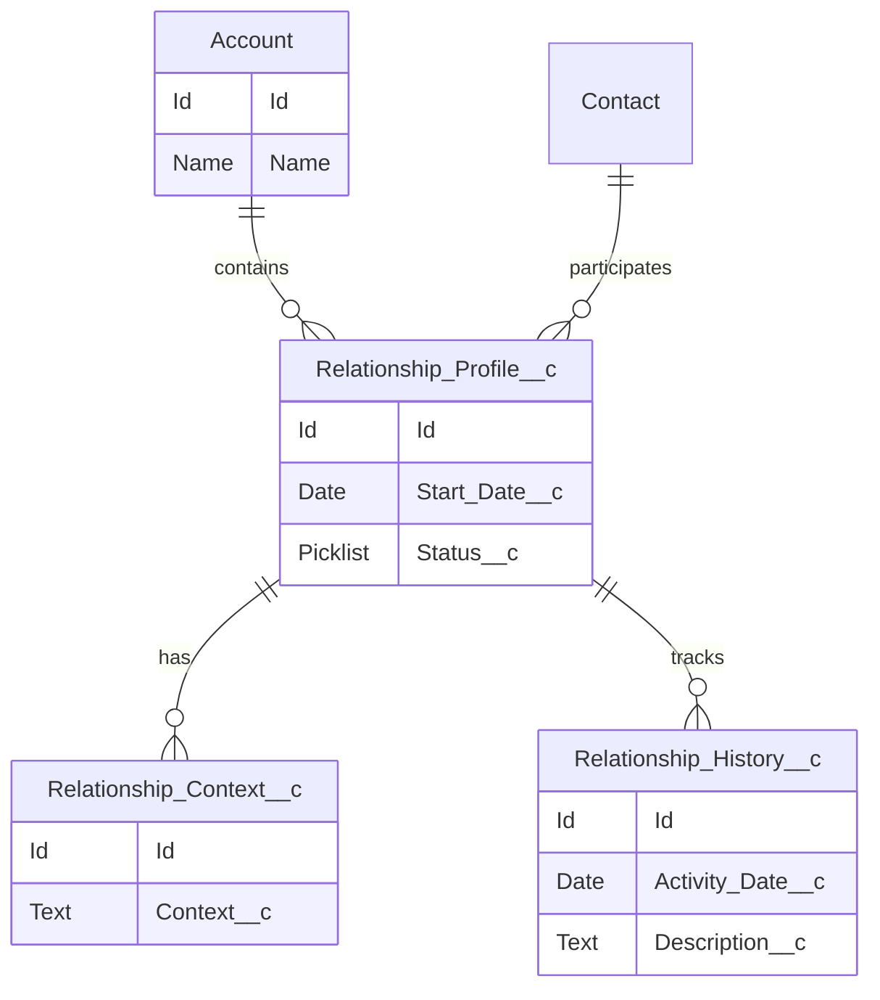

# Data Model & Object Design

## Document Control

| Field         | Value                      |
| ------------- | -------------------------- |
| Document Name | Data Model & Object Design |
| Version       | 1.0                        |
| Status        | Draft                      |

---

# 1. Purpose

This document defines the Salesforce data model supporting the CRM Intelligence Platform.

The design focuses on representing relationships, context, history, and intelligence while remaining scalable.

---

# 2. Data Model Overview

## Proposed Logical Model

Account
│
└──────────────┐
│
Relationship Profile
│
┌─────────┴─────────┐
│ │
Relationship Context Relationship History
│
└───────────────┐
│
(Future)
Agent Observations
AI Recommendations
Relationship Signals

## Sprint 1 Model

Account
|
Relationship Profile
|
+----------------+
| |
Relationship Context
Relationship History

---

# 3. Core Objects

## Relationship Profile

### Purpose

Represents the core business relationship entity within CRM Intelligence.

The object acts as the foundation for relationship intelligence, contextual enrichment and historical tracking.

---

## API Name

Relationship_Profile__c

---

## Fields

| Field             | Type           | Purpose                             |
| ----------------- | -------------- | ----------------------------------- |
| Name              | Text           | Relationship identifier             |
| Relationship Type | Picklist       | Defines relationship category       |
| Status            | Picklist       | Current relationship state          |
| Start Date        | Date           | Relationship start date             |
| End Date          | Date           | Relationship end date               |
| Health Score      | Number         | Relationship health indicator       |
| Notes             | Long Text Area | Additional relationship information |

---

## Relationships

Relationship Profile is the parent entity for:

- Relationship Context
- Relationship History

---

## Security

Sharing Model:

ReadWrite

Field history tracking enabled for key relationship attributes.

---

## Deployment Notes

Implemented as part of Sprint 1 Data Foundation.

Related ADR:

ADR-011 Relationship Data Model Strategy

---

## Relationship Context

### Purpose

The Relationship Context object stores supporting business context for a Relationship Profile.

It provides additional information that enriches the core relationship record without increasing the complexity of the parent object.

The object is designed to support relationship intelligence, reporting, Agentforce interactions and future AI-driven recommendations.

---

### API Name

Relationship_Context__c

---

### Relationship

Relationship Context is a child of Relationship Profile using a Master-Detail relationship.

Sharing Model:

Controlled by Parent

---

### Fields

| Field                | Type           | Required | Description                        |
| -------------------- | -------------- | -------- | ---------------------------------- |
| Name                 | Text           | Yes      | Unique context record name         |
| Relationship Profile | Master-Detail  | Yes      | Parent relationship                |
| Context Type         | Picklist       | Yes      | Category of contextual information |
| Description          | Long Text Area | No       | Detailed contextual information    |
| Priority             | Picklist       | No       | Business priority                  |
| Effective Date       | Date           | No       | Date the context becomes effective |

---

### Design Considerations

- Multiple context records may exist for a single Relationship Profile.
- Security inherits from the parent Relationship Profile.
- Supports future Agentforce prompts and contextual retrieval.
- Enables richer reporting without overloading the parent object.

---

## Relationship History

Purpose:

Maintains historical tracking of relationship changes and interactions.

---

# 4. Object Design Principles

The model follows:

- Salesforce standard objects where possible
- Custom objects only where required
- Clear ownership model
- Reporting capability
- Future AI readiness

---

# 5. Field Design Standards

Fields should include:

- Clear API names
- Appropriate data types
- Help text
- Validation where required
- Field history tracking where valuable

---

# 6. Automation Considerations

Automation should use:

1. Flow for declarative requirements
2. Apex only where complexity requires it

---

# 7. Future Enhancements

Potential extensions:

- Relationship scoring
- Intelligence signals
- Network visualisation
- AI recommendations

---

# 8. Related ADRs

- ADR-001 Data Model Strategy
- ADR-006 Apex Architecture Pattern
