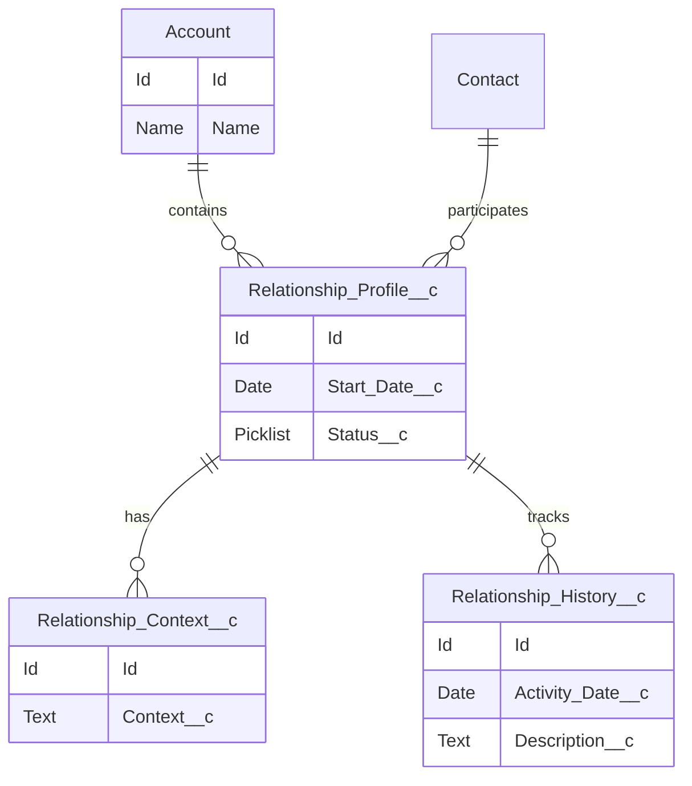

# Data Model & Object Design

## Document Control

| Field         | Value                      |
| ------------- | -------------------------- |
| Document Name | Data Model & Object Design |
| Version       | 1.0                        |
| Status        | Draft                      |

---

# 1. Purpose

This document defines the Salesforce data model supporting the CRM Intelligence Platform.

The design focuses on representing relationships, context, history, and intelligence while remaining scalable.

---

# 2. Data Model Overview

## Proposed Logical Model

Account
│
└──────────────┐
│
Relationship Profile
│
┌─────────┴─────────┐
│ │
Relationship Context Relationship History
│
└───────────────┐
│
(Future)
Agent Observations
AI Recommendations
Relationship Signals

## Sprint 1 Model

Account
|
Relationship Profile
|
+----------------+
| |
Relationship Context
Relationship History

---

# 3. Core Objects

## Relationship Profile

### Purpose

Represents the core business relationship entity within CRM Intelligence.

The object acts as the foundation for relationship intelligence, contextual enrichment and historical tracking.

---

### API Name

Relationship_Profile__c

---

### Fields

| Field             | Type           | Purpose                             |
| ----------------- | -------------- | ----------------------------------- |
| Name              | Text           | Relationship identifier             |
| Relationship Type | Picklist       | Defines relationship category       |
| Status            | Picklist       | Current relationship state          |
| Start Date        | Date           | Relationship start date             |
| End Date          | Date           | Relationship end date               |
| Health Score      | Number         | Relationship health indicator       |
| Notes             | Long Text Area | Additional relationship information |

---

### Relationships

Relationship Profile is the parent entity for:

- Relationship Context
- Relationship History

---

### Security

Sharing Model:

ReadWrite

Field history tracking enabled for key relationship attributes.

Relationship Profile acts as the security boundary for relationship intelligence records.

Record access is controlled through the Relationship Profile sharing model.

Child objects inherit access:

- Relationship Context
- Relationship History

---

### Deployment Notes

Implemented as part of Sprint 1 Data Foundation.

Related ADR:

ADR-011 Relationship Data Model Strategy

---

## Relationship Context

### Purpose

The Relationship Context object stores supporting business context for a Relationship Profile.

It provides additional information that enriches the core relationship record without increasing the complexity of the parent object.

The object is designed to support relationship intelligence, reporting, Agentforce interactions and future AI-driven recommendations.

---

### API Name

Relationship_Context__c

---

### Relationship

Relationship Context is a child of Relationship Profile using a Master-Detail relationship.

Sharing Model:

Controlled by Parent

---

### Fields

| Field                | Type           | Required | Description                        |
| -------------------- | -------------- | -------- | ---------------------------------- |
| Name                 | Text           | Yes      | Unique context record name         |
| Relationship Profile | Master-Detail  | Yes      | Parent relationship                |
| Context Type         | Picklist       | Yes      | Category of contextual information |
| Description          | Long Text Area | No       | Detailed contextual information    |
| Priority             | Picklist       | No       | Business priority                  |
| Effective Date       | Date           | No       | Date the context becomes effective |

---

### Design Considerations

- Multiple context records may exist for a single Relationship Profile.
- Security inherits from the parent Relationship Profile.
- Supports future Agentforce prompts and contextual retrieval.
- Enables richer reporting without overloading the parent object.

---

## Relationship History

### Purpose

The Relationship History object captures significant business events associated with a Relationship Profile.

Relationship History provides a chronological view of relationship activity, supporting operational visibility, reporting, relationship analysis, and future AI-driven insights.

Relationship History is intentionally separate from Salesforce Field History Tracking:

- Field History Tracking captures technical record changes.
- Relationship History captures meaningful business events.

---

### API Name

Relationship_History__c

---

### Relationship

Relationship History is a child object of Relationship Profile using a Master-Detail relationship.

Sharing Model:

Controlled by Parent

Relationship Profile controls access to related Relationship History records.

---

### Fields

| Field                | Type           | Required | Description                       |
| -------------------- | -------------- | -------- | --------------------------------- |
| Name                 | Text           | Yes      | Identifier for the history record |
| Relationship Profile | Master-Detail  | Yes      | Parent relationship record        |
| Event Type           | Picklist       | Yes      | Categorises the business event    |
| Event Date           | Date/Time      | Yes      | Date and time the event occurred  |
| Summary              | Text           | Yes      | Short event description           |
| Description          | Long Text Area | No       | Detailed event information        |
| Source               | Picklist       | No       | Origin of the event               |

---

### Event Type Values

Initial supported values:

- Meeting
- Call
- Email
- Review
- Risk
- Opportunity
- Renewal
- Escalation
- Milestone
- Other

---

### Source Values

Initial supported values:

- Manual
- Automation
- Integration
- Agentforce

---

### Design Considerations

- Multiple Relationship History records can exist for one Relationship Profile.
- History records inherit security from Relationship Profile.
- The model supports relationship timelines and future AI summarisation.
- Business events are separated from technical audit history.

---

# 4. Object Design Principles

The model follows:

- Salesforce standard objects where possible
- Custom objects only where required
- Clear ownership model
- Reporting capability
- Future AI readiness

---

# 5. Field Design Standards

Fields should include:

- Clear API names
- Appropriate data types
- Help text
- Validation where required
- Field history tracking where valuable

---

# 6. Data Quality Rules

## Data Quality Rules

### Purpose

Validation rules are used to enforce business data quality within the CRM Intelligence solution.

The rules prevent incomplete, inconsistent, or invalid relationship data from being saved, regardless of whether records are created manually, through automation, integrations, or future AI-driven processes.

---

## Relationship Profile

### Health Score Validation

**Rule**

Health Score must remain between 0 and 100.

**Purpose**

Ensures relationship health scoring remains consistent and reportable.

---

### Relationship Date Validation

**Rule**

End Date cannot be earlier than Start Date.

**Purpose**

Prevents invalid relationship timelines.

---

## Relationship Context

### High Priority Context Description

**Rule**

High priority context records require a description.

**Purpose**

Ensures important relationship information has sufficient detail.

---

## Relationship History

### Event Summary Required

**Rule**

Every history event must include a summary.

**Purpose**

Ensures timeline records provide meaningful business context.

---

### Event Date Validation

**Rule**

Event Date cannot be in the future.

**Purpose**

Maintains accurate historical records.

## Validation Implementation

Implemented Salesforce validation rules:

| Object               | Rule                               | Purpose                                 |
| -------------------- | ---------------------------------- | --------------------------------------- |
| Relationship Profile | Health Score Range                 | Ensures score remains between 0-100     |
| Relationship Profile | End Date After Start Date          | Maintains valid timelines               |
| Relationship Context | High Priority Requires Description | Ensures important context is documented |
| Relationship History | Summary Required                   | Ensures meaningful history events       |
| Relationship History | Event Date Validation              | Prevents future-dated events            |

## Implementation Status

The CRM Intelligence data quality framework has been implemented using Salesforce validation rules.

Validation controls are applied at the object level to ensure consistent data quality regardless of whether records are created manually, through automation, integrations, or future AI-driven processes.

---

# 7. Automation Considerations

Automation should use:

1. Flow for declarative requirements
2. Apex only where complexity requires it

---

# 8. Future Enhancements

Potential extensions:

- Relationship scoring
- Intelligence signals
- Network visualisation
- AI recommendations

---

# 9. Related ADRs

- ADR-001 Data Model Strategy
- ADR-006 Apex Architecture Pattern
