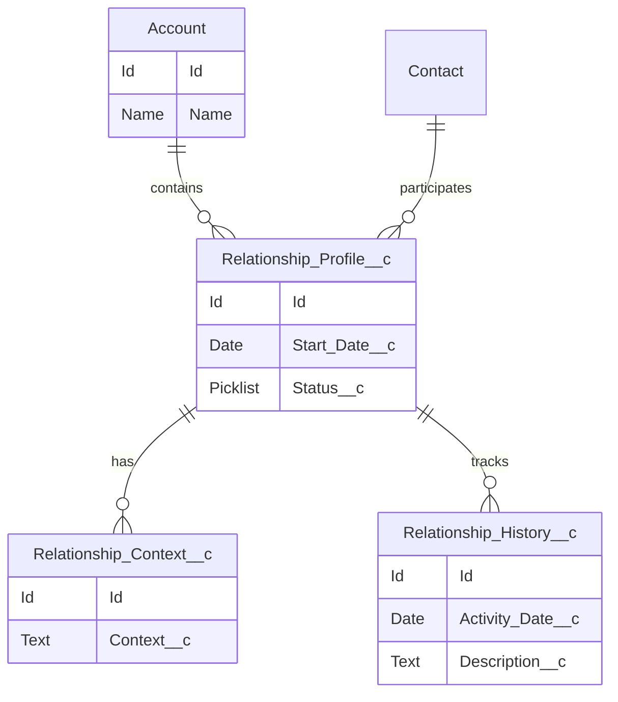

# Data Model & Object Design

## Document Control

| Field         | Value                      |
| ------------- | -------------------------- |
| Document Name | Data Model & Object Design |
| Version       | 1.0                        |
| Status        | Draft                      |

---

# 1. Purpose

This document defines the Salesforce data model supporting the CRM Intelligence Platform.

The design focuses on representing relationships, context, history, and intelligence while remaining scalable.

---

# 2. Data Model Overview

## Sprint 1 Model

Account
|
Relationship Profile
|
+----------------+
| |
Relationship Context
Relationship History

---

# 3. Core Objects

## Relationship Profile

Purpose:

Represents the relationship between Salesforce entities.

Example uses:

- Strategic relationships
- Customer engagement
- Stakeholder connections

---

## Relationship Context

Purpose:

Stores supporting intelligence and contextual information.

Examples:

- Business priorities
- Current objectives
- Relationship notes

---

## Relationship History

Purpose:

Maintains historical tracking of relationship changes and interactions.

---

# 4. Object Design Principles

The model follows:

- Salesforce standard objects where possible
- Custom objects only where required
- Clear ownership model
- Reporting capability
- Future AI readiness

---

# 5. Field Design Standards

Fields should include:

- Clear API names
- Appropriate data types
- Help text
- Validation where required
- Field history tracking where valuable

---

# 6. Automation Considerations

Automation should use:

1. Flow for declarative requirements
2. Apex only where complexity requires it

---

# 7. Future Enhancements

Potential extensions:

- Relationship scoring
- Intelligence signals
- Network visualisation
- AI recommendations

---

# 8. Related ADRs

- ADR-001 Data Model Strategy
- ADR-006 Apex Architecture Pattern
