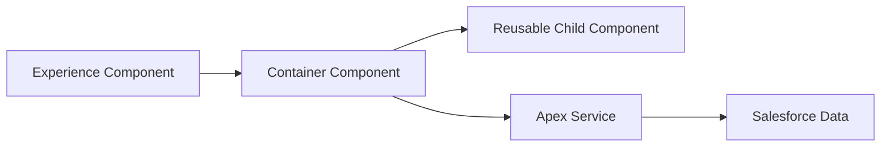

# LWC Component Architecture

## Document Control

| Field         | Value                      |
| ------------- | -------------------------- |
| Document Name | LWC Component Architecture |
| Version       | 1.0                        |
| Status        | Draft                      |

---

# 1. Purpose

This document defines the Lightning Web Component architecture standards for the CRM Intelligence Platform.

The objective is to create reusable, maintainable, and scalable user interface components.

---

# 2. Architecture Principles

## Reusable Components

Components should be designed for reuse across multiple applications.

## Separation of Responsibilities

UI rendering, business logic, and data access should remain separated.

## Enterprise Component Library Approach

Shared components should be created where functionality is common.

---

# 3. Component Structure



---

# 4. Component Types

## Experience Components

Purpose:

- Application pages
- User workflows
- Page-level orchestration

---

## Container Components

Purpose:

- Manage state
- Coordinate data
- Handle events

---

## Presentational Components

Purpose:

- Display information
- Accept properties
- Emit events

---

# 5. Data Access

Components should use:

Preferred:

1. Lightning Data Service
2. Apex Service Layer
3. UI API

Direct database logic inside components is discouraged.

---

# 6. Naming Standards

Components should use:

Example:

```
relationshipProfileCard
relationshipNetworkViewer
relationshipTimeline
```

---

# 7. Testing Standards

All components should include Jest tests covering:

- Rendering
- User interaction
- Data handling
- Error scenarios

---

# 8. Future Enhancements

Future capability:

- Dynamic component loading
- Relationship visualisation
- Agentforce integration

---

# 9. Related Documents

- Developer Build Specification
- Quality & Testing Strategy
- Apex Architecture ADR
