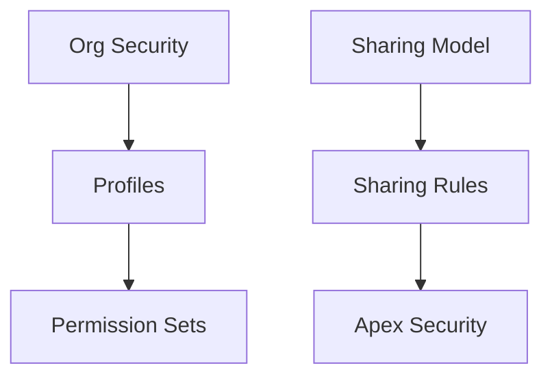

# Security & Sharing Model

## Document Control

| Field         | Value                    |
| ------------- | ------------------------ |
| Document Name | Security & Sharing Model |
| Version       | 1.0                      |
| Status        | Draft                    |

---

# 1. Purpose

This document defines the security approach for the CRM Intelligence Platform.

The model ensures users can access required information while maintaining appropriate governance.

---

# 2. Security Principles

## Least Privilege

Users receive only the access required for their role.

## Role Based Access

Access is controlled through Salesforce security mechanisms.

## Secure by Default

New functionality should default to restricted access.

---

# 3. Security Layers



---

# 4. Access Model

Security is managed through:

- Org-wide defaults
- Role hierarchy
- Permission sets
- Sharing rules
- Record ownership

---

# 5. Permission Strategy

Permission Sets are preferred over profiles for:

- Feature access
- Application permissions
- Controlled capability assignment

---

# 6. Apex Security

All Apex must enforce:

- CRUD checks
- FLS checks
- Sharing enforcement

Example:

```apex
public with sharing class RelationshipService {
}
```

---

# 7. Data Protection

Sensitive information should consider:

- Field level security
- Audit requirements
- Data retention
- Compliance needs

---

# 8. Future Enhancements

Future security considerations:

- Dynamic access models
- Additional governance controls
- Advanced audit reporting

---

# 9. Related Documents

- Solution Architecture Overview
- Data Model & Object Design
- ADR Index
