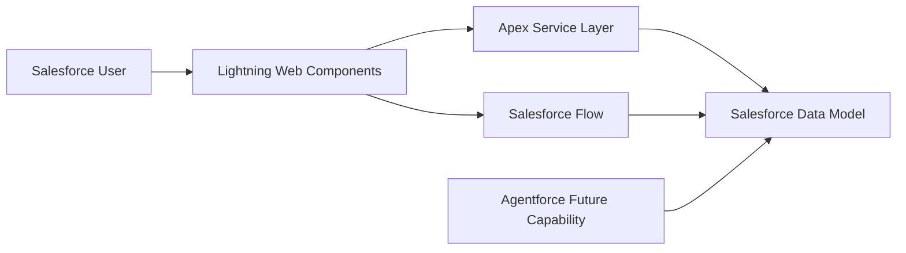

# Solution Architecture Overview

## Document Control

| Field         | Value                          |
| ------------- | ------------------------------ |
| Document Name | Solution Architecture Overview |
| Version       | 1.0                            |
| Status        | Draft                          |
| Owner         | CRM Intelligence Project       |
| Last Updated  | 2026-06-30                     |

---

# 1. Purpose

This document defines the high-level architecture for the CRM Intelligence Platform.

The purpose of the solution is to provide Salesforce users with improved visibility into customer relationships, interactions, insights, and actionable intelligence.

This document provides the architectural foundation for development decisions, technical implementation, and future enhancements.

---

# 2. Solution Overview

The solution is built on the Salesforce Platform using:

- Salesforce Lightning Experience
- Lightning Web Components
- Apex Enterprise patterns
- Salesforce Flow
- Custom data model extensions
- Agentforce capabilities (future enhancement)

The design follows Salesforce recommended practices for maintainability, scalability, security, and governance.

---

# 3. Architecture Principles

## Metadata First

Configuration and declarative capabilities should be preferred where appropriate.

## Separation of Concerns

Business logic, user interface, data access, and automation responsibilities should remain separated.

## Maintainability

Solutions should support future enhancement without requiring significant redesign.

## Security by Design

Access control must be considered during design rather than added afterwards.

## Source Driven Development

All metadata and configuration should be managed through version control.

---

# 4. High Level Architecture

The Salesforce application architecture uses a relationship-centric data model described in the Application Architecture section.



---

# 5. Application Architecture

The solution uses a layered approach:

| Layer            | Responsibility               |
| ---------------- | ---------------------------- |
| Experience Layer | LWC user interface           |
| Service Layer    | Apex orchestration           |
| Domain Layer     | Business rules               |
| Data Layer       | Salesforce objects           |
| Automation Layer | Flow and platform automation |

## CRM Intelligence Data Model

```
Account
|
Relationship Profile
|
+----------------+
|                |
Relationship  Relationship
Context       History
```

Relationship Profile represents the central relationship entity.

Relationship Context stores supporting information about the relationship.

Relationship History records significant business events over time and provides a chronological relationship timeline.

The model supports reporting, operational insight, and future Agentforce capabilities.

### Relationship Profile

The Relationship Profile object acts as the central relationship entity.

Responsibilities:

- Represents business relationships
- Stores relationship lifecycle information
- Provides the foundation for contextual and historical intelligence

### Relationship Context

Stores additional information and intelligence associated with a relationship.

### Relationship History

Captures relationship events and changes over time.

The model follows the principles defined in ADR-011 – Relationship Data Model Strategy.

### User Experience

The CRM Intelligence application provides navigation to:

- Relationship Profiles
- Relationship Contexts
- Relationship Histories

Relationship Profile acts as the primary user-facing record with related lists providing access to supporting context and historical events.

---

# 6. Automation Architecture

The CRM Intelligence solution uses Salesforce Flow as the primary automation technology.

Automation is event-driven and operates directly on the CRM Intelligence data model.

The solution uses:

- Record-Triggered Flows
- Before Save Flows for efficient field updates
- After Save Flows for related record creation
- Declarative automation before Apex

Automation supports:

- Relationship lifecycle management
- Relationship history generation
- Business process consistency
- Future AI-assisted workflows

---

# 7. Automation Catalogue

## Planned Automation

| Business Event | Automation | Sprint |
| --- | --- |
| Relationship Profile created | Create initial Relationship History entry | Sprint 2 |
| Relationship Status updated | Record status change in Relationship History | Sprint 2 |
| Relationship Profile updated | Track significant business changes | Sprint 2 |
| Relationship Context created | No automation | Future |
| Relationship closed | Create closure history entry | Sprint 2 |
| Relationship archived | Future retention process | Future |

---

# 8. Integration Approach

The initial MVP is designed for Salesforce-native capability.

Future integrations may include:

- External intelligence platforms
- Data enrichment services
- AI services
- Customer data platforms

---

# 9. Deployment Approach

Deployment will follow:

- Source control driven development
- Feature branching
- Pull request review
- Automated validation
- Controlled promotion

---

# 10. Future Considerations

Future roadmap enhancements include:

- Relationship network visualisation
- AI-generated recommendations
- Advanced analytics
- Automated relationship insights

---

# 11. Related Documents

- Data Model & Object Design
- Security & Sharing Model
- LWC Component Architecture
- ADR Index
- Developer Build Specification
- ADR-011 – Relationship Data Model Strategy
- Data Model & Object Design
