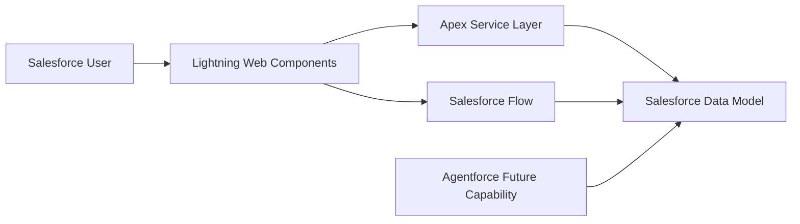

# Solution Architecture Overview

## Document Control

| Field         | Value                          |
| ------------- | ------------------------------ |
| Document Name | Solution Architecture Overview |
| Version       | 1.0                            |
| Status        | Draft                          |
| Owner         | CRM Intelligence Project       |
| Last Updated  | 2026-06-30                     |

---

# 1. Purpose

This document defines the high-level architecture for the CRM Intelligence Platform.

The purpose of the solution is to provide Salesforce users with improved visibility into customer relationships, interactions, insights, and actionable intelligence.

This document provides the architectural foundation for development decisions, technical implementation, and future enhancements.

---

# 2. Solution Overview

The solution is built on the Salesforce Platform using:

- Salesforce Lightning Experience
- Lightning Web Components
- Apex Enterprise patterns
- Salesforce Flow
- Custom data model extensions
- Agentforce capabilities (future enhancement)

The design follows Salesforce recommended practices for maintainability, scalability, security, and governance.

---

# 3. Architecture Principles

## Metadata First

Configuration and declarative capabilities should be preferred where appropriate.

## Separation of Concerns

Business logic, user interface, data access, and automation responsibilities should remain separated.

## Maintainability

Solutions should support future enhancement without requiring significant redesign.

## Security by Design

Access control must be considered during design rather than added afterwards.

## Source Driven Development

All metadata and configuration should be managed through version control.

---

# 4. High Level Architecture

---

# 5. Application Architecture

The solution uses a layered approach:

| Layer            | Responsibility               |
| ---------------- | ---------------------------- |
| Experience Layer | LWC user interface           |
| Service Layer    | Apex orchestration           |
| Domain Layer     | Business rules               |
| Data Layer       | Salesforce objects           |
| Automation Layer | Flow and platform automation |

---

# 6. Integration Approach

The initial MVP is designed for Salesforce-native capability.

Future integrations may include:

- External intelligence platforms
- Data enrichment services
- AI services
- Customer data platforms

---

# 7. Deployment Approach

Deployment will follow:

- Source control driven development
- Feature branching
- Pull request review
- Automated validation
- Controlled promotion

---

# 8. Future Considerations

Future roadmap enhancements include:

- Relationship network visualisation
- AI-generated recommendations
- Advanced analytics
- Automated relationship insights

---

# 9. Related Documents

- Data Model & Object Design
- Security & Sharing Model
- LWC Component Architecture
- ADR Index
- Developer Build Specification
