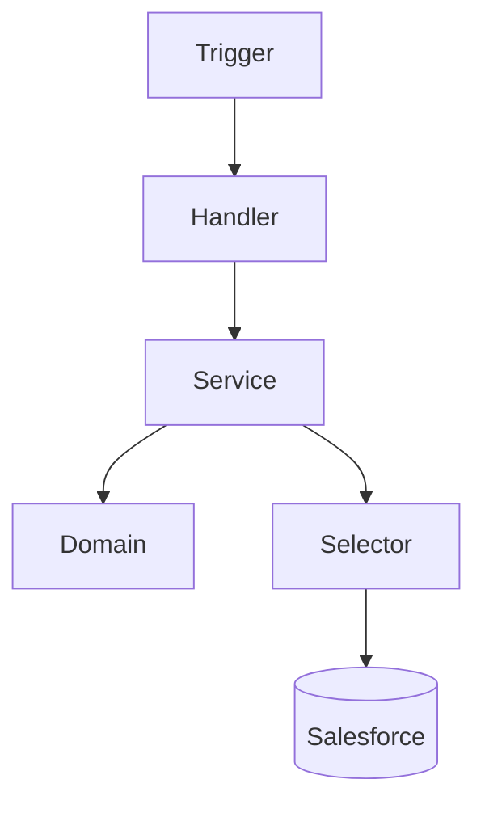

# ADR-006 Apex Architecture Pattern

## Status

Accepted

---

# Context

The CRM Intelligence Platform requires Apex development that remains maintainable as functionality increases.

Apex logic must support:

- Complex business rules
- Reusable services
- Testing
- Future enhancements

A simple trigger-based approach would create tightly coupled logic and reduce maintainability.

---

# Decision

Adopt an enterprise Apex layered architecture pattern.

The solution will use:

- Trigger framework
- Handler layer
- Service layer
- Domain layer
- Selector layer

---

# Architecture

---

# Alternatives Considered

## Option 1: Trigger Logic

Rejected.

Reason:

Creates tightly coupled and difficult-to-test code.

---

## Option 2: Flow Only

Rejected as the complete solution.

Reason:

Flow remains useful but cannot handle all complex scenarios.

---

## Option 3: Enterprise Apex Pattern

Selected.

Reason:

Provides scalability and separation of concerns.

---

# Consequences

Benefits:

- Better maintainability
- Easier testing
- Clear ownership boundaries

Trade-offs:

- Additional initial structure
- More classes required

---

# Related Documents

- Developer Build Specification
- Solution Architecture Overview
