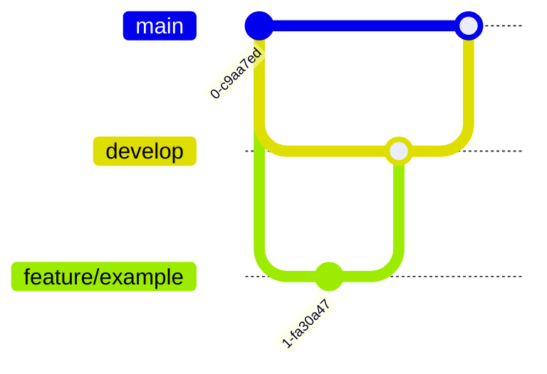

# Release & Deployment Strategy

## Document Control

| Field   | Value |
| ------- | ----- |
| Version | 1.0   |
| Status  | Draft |

---

# 1. Purpose

Defines how Salesforce changes move from development through release.

---

# 2. Release Principles

The approach ensures:

- Controlled deployments
- Traceability
- Reduced risk
- Repeatability

---

# 3. Branch Strategy



---

# 4. Deployment Flow

```text id="7jrf9v"
Developer Org

↓

Feature Validation

↓

Integration Environment

↓

UAT

↓

Production
```

---

# 5. Deployment Methods

Preferred:

- Salesforce CLI
- Metadata deployment
- Automated validation

---

# 6. Release Checklist

Before release:

- Tests complete
- Security reviewed
- Deployment validated
- Documentation updated

---

# 7. Rollback

Rollback options:

- Metadata reversal
- Previous package version
- Git revert

---

# 8. Related Documents

- Data Migration & Cutover
- Quality Strategy
- Developer Build Specification
