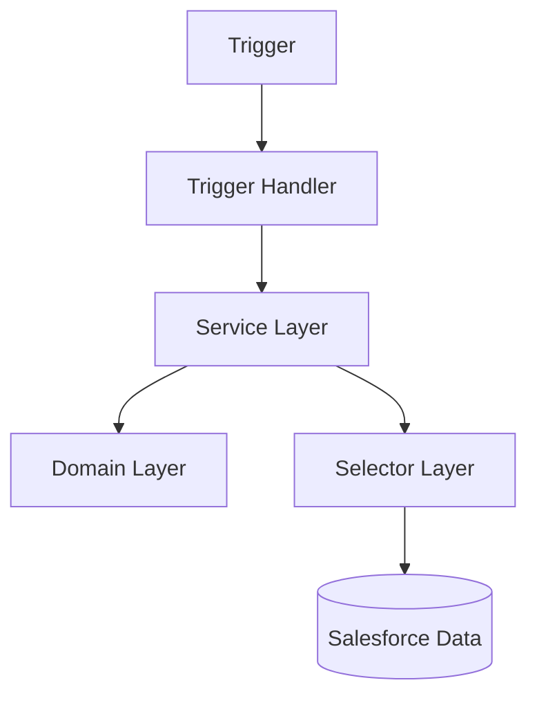

# Developer Build Specification

## Document Control

| Field         | Value                         |
| ------------- | ----------------------------- |
| Document Name | Developer Build Specification |
| Version       | 1.0                           |
| Status        | Draft                         |

---

# 1. Purpose

Defines development standards and implementation guidance for the CRM Intelligence Platform.

---

# 2. Development Approach

The project follows:

- Salesforce DX
- Source driven development
- Feature branching
- Pull request workflow
- Automated validation

---

# 3. Repository Standards

Structure:

```
crm-intelligence

├── force-app
├── scripts
├── config
├── docs
└── package.json
```

---

# 4. Apex Architecture Pattern

The solution follows an enterprise layered approach.



---

# 5. Apex Standards

## Trigger Rules

Triggers should:

- Contain no business logic
- Delegate processing

---

## Service Layer

Responsible for:

- Business orchestration
- Transactions
- Process coordination

---

## Selector Layer

Responsible for:

- SOQL queries
- Query reuse
- Data access

---

# 6. Flow vs Apex

Use Flow when:

- Logic is declarative
- Simple automation
- Admin maintainable

Use Apex when:

- Complex logic
- Integration
- Advanced processing

---

# 7. Deployment Standards

All changes require:

- Feature branch
- Review
- Testing
- Documentation updates

---

# 8. Code Quality

Required checks:

- ESLint
- Prettier
- Jest
- Apex tests

---

# 9. Related Documents

- Solution Architecture
- Quality Strategy
- Release Strategy
