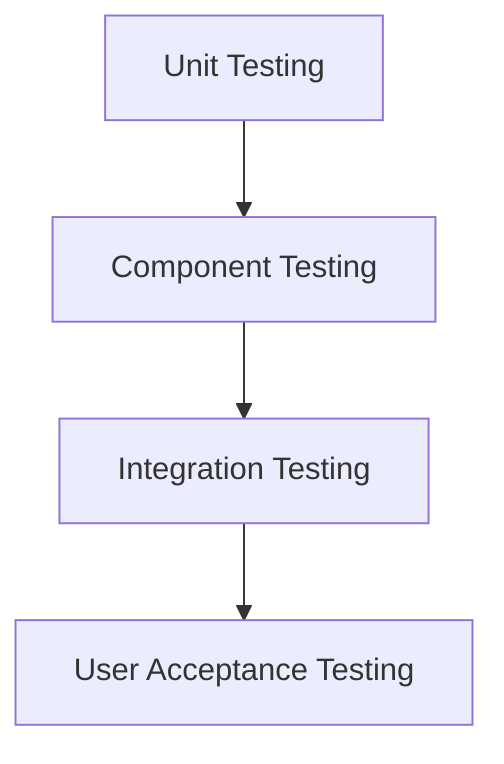

# Quality & Testing Strategy

## Document Control

| Field   | Value |
| ------- | ----- |
| Version | 1.0   |
| Status  | Draft |

---

# 1. Purpose

Defines the quality assurance approach for the CRM Intelligence Platform.

---

# 2. Testing Principles

The solution follows:

- Automated testing
- Early validation
- Regression prevention
- Quality gates

---

# 3. Testing Levels

---

# 4. Apex Testing

Requirements:

- Minimum 75% coverage
- Meaningful assertions
- Positive and negative scenarios

Tests must validate:

- Business logic
- Security
- Error handling

---

# 5. Lightning Web Component Testing

Jest tests cover:

- Component rendering
- User interaction
- Event handling
- Error states

---

# 6. Flow Testing

Validate:

- Entry criteria
- Outcomes
- Fault paths
- Permissions

---

# 7. Deployment Validation

Before release:

- Automated checks
- Apex tests
- Static analysis
- Deployment validation

---

# 8. Quality Gates

A release requires:

- Tests passing
- Review completed
- Documentation updated

---

# 9. Related Documents

- Developer Build Specification
- Release Strategy

# 10. Sprint Validations

## Sprint 2 Automation Validation

- Status change automation verified.
- Context automation verified.
- Relationship History records created correctly.
- CASE mapping validated.
- Parent relationships verified.
- Source tracking verified.
