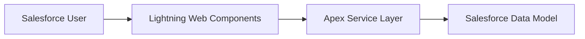

# CRM Intelligence Platform

## Overview

CRM Intelligence Platform is a Salesforce solution designed to improve customer relationship visibility, context, and decision-making.

The platform provides users with enhanced insight into relationship health, engagement history, and actionable intelligence.

The solution is built using Salesforce-native capabilities with an architecture designed for scalability, maintainability, and future AI-driven enhancements.

---

# Business Objective

Modern CRM systems capture significant customer data, but users often lack a complete understanding of relationship context.

This solution aims to:

- Improve relationship visibility
- Capture meaningful customer context
- Support informed decision making
- Enable future intelligence capabilities

---

# Solution Summary

The platform provides:

- Relationship management capabilities
- Context and history tracking
- Secure access model
- Extensible Lightning Web Components
- Enterprise Apex architecture
- Future Agentforce integration opportunities

---

# Architecture Overview

The solution follows a layered Salesforce architecture:



---

# Technology Stack

| Technology               | Purpose              |
| ------------------------ | -------------------- |
| Salesforce Platform      | Application platform |
| Lightning Web Components | User interface       |
| Apex                     | Business logic       |
| Salesforce Flow          | Automation           |
| GitHub                   | Source control       |
| Salesforce DX            | Development workflow |
| Jest                     | Component testing    |

---

# Repository Structure

```text
crm-intelligence

├── force-app
│   └── Salesforce metadata
│
├── scripts
│   └── Development utilities
│
├── config
│   └── Project configuration
│
└── docs
    ├── Product strategy
    ├── Solution architecture
    ├── Architecture governance
    ├── Engineering standards
    ├── Operations
    ├── Portfolio material
    └── Testing strategy
```

---

# Documentation

## Product Strategy

Contains:

- Product vision
- Roadmap
- Product backlog

Location:

```
docs/01-product-strategy
```

---

## Solution Architecture

Contains:

- Architecture overview
- Data model
- Security model
- Component architecture

Location:

```
docs/02-solution-architecture
```

---

## Architecture Governance

Contains:

- Architecture decisions
- ADR index
- Technical decisions

Location:

```
docs/03-architecture-governance
```

---

## Engineering

Contains:

- Development standards
- Build specifications
- Deployment guidance

Location:

```
docs/04-engineering-and-delivery
```

---

# Development Setup

## Prerequisites

Required:

- Salesforce CLI
- VS Code
- Salesforce Extension Pack
- Node.js

---

## Install Dependencies

```bash
npm install
```

---

## Run Formatting Validation

```bash
npm run prettier:verify
```

---

## Run Linting

```bash
npm run lint
```

---

## Run Tests

```bash
npm test
```

---

# Development Workflow

Changes follow:

```text
Feature Branch

↓

Development

↓

Testing

↓

Pull Request

↓

Merge
```

---

# Branch Strategy

Main branches:

| Branch    | Purpose       |
| --------- | ------------- |
| main      | Release ready |
| develop   | Integration   |
| feature/* | Development   |

---

# Quality Standards

All changes should include:

- Testing
- Documentation updates
- Code review
- Validation

---

# Roadmap

Current phase:

## Release 0.1

Project Foundation

Completed:

- Salesforce DX setup
- Git repository
- Developer environment
- Engineering standards

Next:

- Data foundation
- Apex framework
- Relationship intelligence capability

---

# Future Enhancements

Planned:

- Relationship scoring
- Network visualisation
- AI-powered recommendations
- Agentforce integration

---

# Project Status

| Area                  | Status   |
| --------------------- | -------- |
| Architecture          | Complete |
| Repository Setup      | Complete |
| Development Standards | Complete |
| Data Model            | Planned  |
| Application Build     | Upcoming |

---

# License

Portfolio project.
